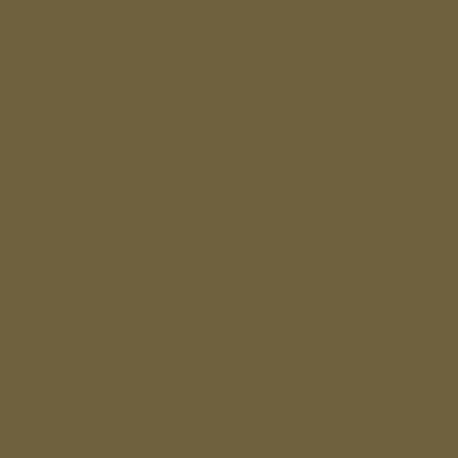
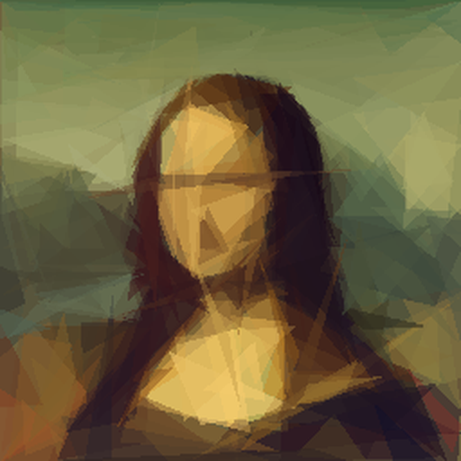
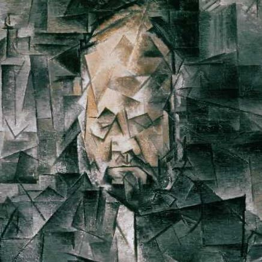
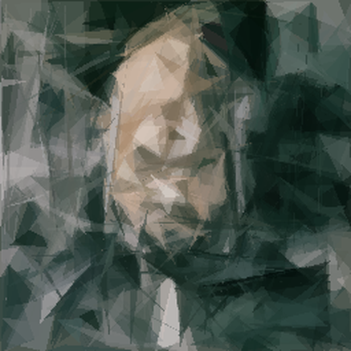
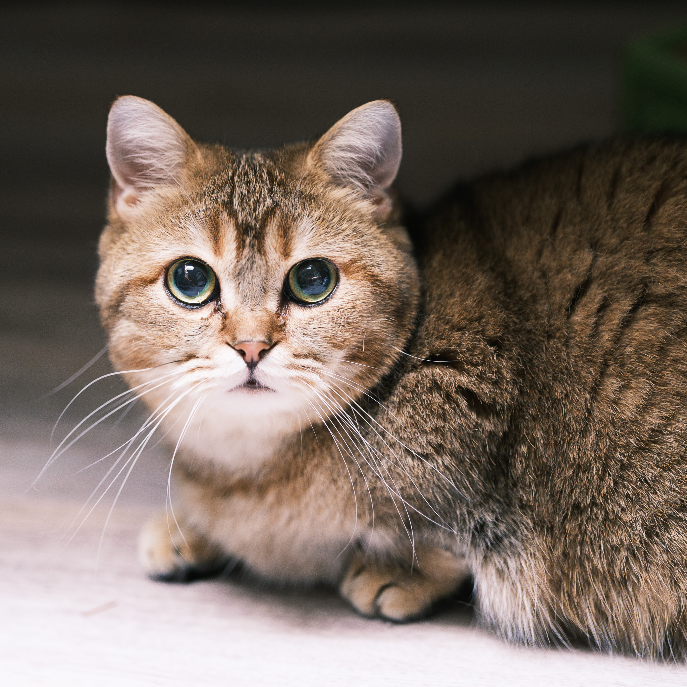

# Primitive Pictures 🎨

Transform photos into stunning geometric art using triangles, rectangles, and other primitive shapes.

<p align="center">
  
</p>

**Primitive Pictures** is an algorithmic art generator that recreates images using only simple geometric shapes. It works by iteratively adding one shape at a time, intelligently selecting each new shape to best improve the overall approximation of the target image.

### Animation Showcase

<div align="center">
  <table>
  <tr>
    <td></td>
    <td></td>
    <td></td>
  </tr>
  <tr>
    <td align="center">Picasso</td>
    <td align="center">Mona Lisa</td>
    <td align="center">Cat</td>
  </tr>
  </table>
</div>

## Key Features

- **Geometric Art Creation**: Transform any image into stunning geometric art
- **Multiple Shape Types**: Triangles, rectangles, ellipses, circles, and rotated rectangles
- **Animated Process**: Watch the image build up shape by shape
- **SVG Output**: Generate infinitely scalable vector graphics
- **Optimization Algorithms**: Intelligent shape selection for optimal results

This repository contains two implementations of the Primitive algorithm:

1. **Original Go Implementation** - The classic CPU-based implementation with hill climbing optimization
2. **Python Implementation** - A modern PyTorch-based version with differential evolution and advanced animation controls

## Showcase Gallery

Here are some examples of the algorithm in action, showing how it transforms photographs into geometric art:

<div align="center">
  <table>
  <tr>
    <th>Example</th>
    <th>Original Image</th>
    <th>Primitive Output</th>
    <th>Process Animation</th>
  </tr>
  <tr>
    <td><b>Mona Lisa</b></td>
    <td></td>
    <td></td>
    <td></td>
  </tr>
  <tr>
    <td><b>Picasso</b></td>
    <td></td>
    <td></td>
    <td></td>
  </tr>
  <tr>
    <td><b>Cat</b></td>
    <td></td>
    <td></td>
    <td></td>
  </tr>
  </table>
</div>

Each example demonstrates how the algorithm progressively builds up the image using geometric shapes. The animations show the step-by-step process, with more focus on the critical early shapes that establish the major structures.

> **Animation Note:** Our intelligent frame distribution strategy focuses more frames on the first 50 shapes (where major structural changes happen) and fewer frames on later shapes (which add subtle details), creating smooth animations without overwhelming file sizes.

## Shape Compositing and Rendering

The Primitive algorithm builds images through a process of additive shape compositing:

```
┌───────────┐    ┌───────────┐    ┌───────────┐    ┌───────────┐
│           │    │▒▒▒        │    │▒▒▒        │    │▒▒▒   ░░░░ │
│           │ +  │▒▒▒        │ +  │    ▓▓▓▓▓▓ │ +  │    ▓▓▓▓▓▓ │ + ...
│           │    │▒▒▒        │    │    ▓▓▓▓▓▓ │    │    ▓▓▓▓▓▓ │
└───────────┘    └───────────┘    └───────────┘    └───────────┘
 Background       Shape 1          Shape 2          Shape 3
```

Each shape has these properties:
- **Geometry**: Varies by shape type (points for triangles, center/radius for circles, etc.)
- **Color**: RGB color values determined to best match the target image
- **Alpha**: Transparency level (usually between 50-150 out of 255) for blending

#### Different Shape Types and Their Effects

Each shape type has distinct characteristics that make it suitable for different types of images:

```
┌─────────────────┬────────────────────┬───────────────────────────────┐
│ Shape Type      │ Visual Example     │ Best Used For                 │
├─────────────────┼────────────────────┼───────────────────────────────┤
│ Triangles       │  ▲  ▲  ▲           │ General purpose, good balance  │
│ (Mode 1)        │ ▲▲▲▲▲▲▲           │ of detail and efficiency       │
├─────────────────┼────────────────────┼───────────────────────────────┤
│ Rectangles      │ ┌─┐┌─┐┌─┐          │ Architectural images, images   │
│ (Mode 2)        │ │ ││ ││ │          │ with straight lines and grids  │
│                 │ └─┘└─┘└─┘          │                               │
├─────────────────┼────────────────────┼───────────────────────────────┤
│ Ellipses        │ (  ) (  )          │ Portraits, organic forms,      │
│ (Mode 3)        │(    )(    )        │ smooth gradients, faces        │
├─────────────────┼────────────────────┼───────────────────────────────┤
│ Circles         │  ○  ○  ○           │ Abstract art, images with      │
│ (Mode 4)        │ ○  ○  ○  ○         │ circular elements, pointillism │
├─────────────────┼────────────────────┼───────────────────────────────┤
│ Rotated         │   ┌─┐  ╱╱           │ Images with diagonal elements, │
│ Rectangles      │  ╱╱  ┌─┐           │ better coverage than regular   │
│ (Mode 5)        │ ╱╱   ╱╱            │ rectangles                     │
└─────────────────┴────────────────────┴───────────────────────────────┘
```

#### Progressive Image Formation

Here's a visual representation of how an image builds up through multiple shapes:

```
Initial         After 10         After 50         After 200
Background      Shapes           Shapes           Shapes
┌────────────┐  ┌────────────┐  ┌────────────┐  ┌────────────┐
│            │  │ ▲          │  │ ▲▲▲        │  │ ▲▲▲▲▲▲▲▲▲▲ │
│            │  │ ▲▲         │  │ ▲▲▲▲       │  │ ▲▲▲▲▲▲▲▲▲▲ │
│            │  │ ▲▲▲        │  │ ▲▲▲▲▲      │  │ ▲▲▲▲▲▲▲▲▲▲ │
│            │  │ ▲▲▲▲       │  │ ▲▲▲▲▲▲     │  │ ▲▲▲▲▲▲▲▲▲▲ │
│            │  │ ▲▲▲▲▲      │  │ ▲▲▲▲▲▲▲    │  │ ▲▲▲▲▲▲▲▲▲▲ │
│            │  │            │  │            │  │            │
└────────────┘  └────────────┘  └────────────┘  └────────────┘
```

As more shapes are added:
1. The first few shapes establish the major color areas and composition
2. Shapes 10-50 define important features and edges
3. Shapes 50-200 refine details and improve local color matching 
4. Shapes beyond 200 make increasingly subtle refinements

### Key Technical Aspects

- **Color handling**: Each shape has an RGBA color, allowing for semi-transparency
- **Alpha blending**: Shapes are blended with the existing canvas using alpha compositing
- **Parallel processing**: Multiple candidate shapes are evaluated simultaneously
- **Early stopping**: The optimization process stops early if no improvements are detected
- **Memory management**: Tensors and images are carefully managed to prevent memory issues

### Performance Considerations

- **Input resize**: Smaller input sizes process faster but produce less accurate results
- **Shape count**: More shapes create more detailed approximations but take longer to generate
- **Shape type**: Different shapes have different computational costs (triangles are fastest)
- **Optimization parameters**: More candidates and generations produce better results but take longer

This algorithm creates a progressive approximation, with each additional shape refining the image further. The first shapes typically capture large color areas, while later shapes add finer details.

## Animation Control

The Python implementation features an intelligent frame distribution strategy for animations that balances detail and file size:

1. **First 10 shapes**: Every shape is included to capture initial major structural changes
2. **Shapes 11-30**: Every 2nd shape is included to show medium-scale refinements
3. **Shapes 31-50**: Every 3rd shape is included to show finer adjustments
4. **Shapes 51+**: Every 5th shape is included to show detail refinements

### Why Progressive Frame Distribution Matters

Without a smart frame distribution strategy, animations face two common problems:

1. **Too many frames** - Including every shape in the animation creates unnecessarily large files and slow-loading GIFs, especially with hundreds of shapes.
2. **Uniform sampling** - Selecting frames at fixed intervals misses important early changes and includes too many similar later frames.

The progressive distribution solves these problems by:

- **Emphasizing early changes**: The first shapes make the most dramatic visual impact and receive more frames
- **Gradually reducing detail**: Later shapes typically make smaller refinements and need fewer frames
- **Optimizing file size**: Fewer total frames means smaller, more shareable GIF files
- **Balancing detail and efficiency**: The animation still shows the full process without redundancy

This approach results in animations that are more informative, load faster, and better highlight the shape-building process. With a typical 200-shape image, the animation might include just 55-60 frames instead of 200, while still effectively showing the image's evolution.

You can control the animation playback speed:

```bash
# Create a faster animation (10 FPS)
py_primitive -i input.jpg -o animation.gif -n 100 --frames 50 --fps 10

# Create a slower, more detailed animation (3 FPS)
py_primitive -i input.jpg -o animation.gif -n 100 --frames 50 --fps 3
```

## Implementations

### Go Implementation (Original)

The original implementation by Michael Fogleman is written in Go and uses hill climbing optimization to find optimal shapes.

* Location: [go_primitive/](go_primitive/)
* Features: CPU-based, hill climbing optimization, multi-core support
* See the [Go implementation README](go_primitive/README.md) for more details

### Python Implementation (New)

A modern reimplementation that uses PyTorch for flexible optimization with added features.

* Location: [py_primitive/](py_primitive/)
* Features: Advanced optimization, parallel shape evaluation, animation control
* Optional GPU support with PyTorch (currently experimental, may be slower than CPU)
* See the [Python implementation README](py_primitive/README.md) for more details

## Performance Comparison

The Python implementation offers several advantages over the original Go version:

* **Better animation control** with customizable FPS
* **Improved quality** due to testing more shape variations
* **Better optimization** through advanced optimization algorithms
* **Simplified extension** through Python's ecosystem

Note: While the implementation includes GPU support via PyTorch's Metal Performance Shaders (MPS) backend, we've found that it currently performs slower than CPU for most workloads. GPU acceleration is considered experimental at this time.

## Quick Start

### Go Implementation

```bash
cd go_primitive
go build
./primitive -i input.png -o output.png -n 100
```

### Python Implementation

#### Full CLI

```bash
cd py_primitive
./install.sh
py_primitive -i input.jpg -o output.png -n 100
```

#### Convenient Wrapper Script

Use the wrapper script for a simpler interface that handles common defaults:

```bash
# From project root
python run_example.py [input_image] [options]

# Examples:
# Generate 50 triangles with original image size
python run_example.py --shapes 50

# Use rectangles instead of triangles
python run_example.py --shapes 50 --mode 2

# Create a slow animation (3 FPS)
python run_example.py --shapes 50 --fps 3

# Create high-resolution output (2048px)
python run_example.py --shapes 50 --size 2048

# Enable experimental GPU acceleration (may be slower)
python run_example.py --shapes 50 --use-gpu
```

## Supported Shape Types

Both implementations support multiple primitive shape types:

1. **Triangles (mode 1)** - Default, excellent balance of simplicity and expressiveness
2. **Rectangles (mode 2)** - Good for architectural images with straight lines
3. **Ellipses (mode 3)** - Effective for organic forms and portraits
4. **Circles (mode 4)** - Creates a more abstract style
5. **Rotated Rectangles (mode 5)** - Useful for diagonal features

## How It Works: Algorithm Walkthrough

The Primitive algorithm creates artwork by approximating images with simple geometric shapes. Here's a step-by-step explanation of how it works:

### Core Algorithm Visualized

```
┌─────────────────┐     ┌─────────────────┐     ┌─────────────────┐
│  Original Image │ ──> │  Background     │ ──> │  + Shape 1      │ ──> ...
│                 │     │  (Avg Color)    │     │                 │
└─────────────────┘     └─────────────────┘     └─────────────────┘
                                                        │
                                                        ▼
                               ...  <──  ┌─────────────────┐
                                         │  + Shape N      │
                                         │                 │
                                         └─────────────────┘
```

The algorithm follows these main steps:

1. **Start with a blank canvas**: The algorithm begins with a solid-colored background (usually the average color of the target image).

2. **Shape generation**: For each iteration:
   - Generate a set of random candidate shapes (triangles, rectangles, etc.)
   - Evaluate how well each shape improves the current approximation
   - Select the best shape and add it to the canvas
   - Repeat until the desired number of shapes is reached

3. **Shape evaluation**: To find the "best" shape:
   - For each candidate shape, render it onto a copy of the current canvas
   - Calculate the difference between this new canvas and the target image
   - Choose the shape that minimizes this difference (i.e., improves the approximation the most)

4. **Optimization**: To find optimal shape parameters:
   - The Go implementation uses hill climbing (making small adjustments to improve the shape)
   - The Python implementation uses differential evolution (testing populations of shapes and evolving them)

### Visual Workflow

```
                           ┌──────────────────────┐
                           │     Target Image     │
                           └──────────────┬───────┘
                                          │
                                          ▼
                           ┌──────────────────────┐
                           │  Create Background   │
                           │   (Average Color)    │
                           └──────────────┬───────┘
                                          │
                                          ▼
┌───────────────────────┐  ┌──────────────────────┐
│                       │  │ Generate Random      │
│                       │◄─┤ Candidate Shapes     │
│                       │  │                      │
│    Optimization       │  └──────────────┬───────┘
│    Process            │                 │
│                       │  ┌──────────────▼───────┐
│    ┌─────────┐        │  │ Evaluate Each Shape  │
│    │ Mutate  │        │  │ (Score = Difference  │
│    │ Shapes  │◄──────────┤ from Target Image)   │
│    └────┬────┘        │  └──────────────┬───────┘
│         │             │                 │
│         ▼             │  ┌──────────────▼───────┐
│    ┌─────────┐        │  │ Select Best Shape    │
│    │ Evaluate│        │  │ (Lowest Score)       │
│    │ Fitness │        │  └──────────────┬───────┘
│    └────┬────┘        │                 │
│         │             │  ┌──────────────▼───────┐
│    ┌─────────┐        │  │ Add Shape to Canvas  │
│    │ Select  │        │  └──────────────┬───────┘
│    │ Best    │        │                 │
│    └─────────┘        │  ┌──────────────▼───────┐
│                       │  │ More Shapes Needed?  │
└───────────────────────┘  └──────────────┬───────┘
                                          │
                                          ▼
                           ┌──────────────────────┐
                           │   Final Image with   │
                           │     N Shapes         │
                           └──────────────────────┘
```

### Detailed Process

#### 1. Image Preparation

![Image Preparation Diagram]

The process begins with preparing the target image:
- Load the target image
- Resize it to a manageable size for processing (controlled by `--input-resize`)
- Calculate the average color for the initial background
- Create a blank canvas filled with this average color

#### 2. Shape Optimization

![Shape Optimization Diagram]

For each new shape:
- **Candidate Generation**: Create multiple random shapes with random positions, colors, and sizes
- **Evaluation**: For each candidate shape:
  * Render the shape onto a copy of the current canvas
  * Calculate the difference (error) between this new canvas and the target image
  * The lower the error score, the better the shape fits
- **Refinement**: The optimization algorithm iteratively improves promising shapes:
  * Go implementation: Hill climbing with small random adjustments
  * Python implementation: Differential evolution with crossover and mutation

#### 3. Shape Addition

![Shape Addition Diagram]

The best shape from the optimization process is permanently added to the canvas:
- Render the shape with its optimal parameters (position, size, color, alpha)
- Blend it with the existing canvas using alpha compositing
- Update the current state of the canvas

#### 4. Progressive Improvement

![Progressive Improvement Diagram]

As shapes are added, the image gradually improves:
- Early shapes capture large areas and major features
- Middle shapes define medium-scale structures and edges
- Later shapes add subtle details and refinements

The algorithm naturally focuses on the most visually important areas first, with diminishing returns as more shapes are added:

```
┌─────────────────────────────────────────────────────────┐
│                                                         │
│  Image Quality                                          │
│  ▲                                                      │
│  │                                                      │
│  │               ●                                      │
│  │             ●                                        │
│  │           ●                                          │
│  │         ●                                            │
│  │       ●                                              │
│  │     ●                                                │
│  │   ●                                                  │
│  │ ●                                                    │
│  └─────────────────────────────────────────────────────▶│
│    0      50      100     150     200     250    300    │
│                   Number of Shapes                      │
└─────────────────────────────────────────────────────────┘
```

This graph illustrates the diminishing returns of adding more shapes - the most significant improvements happen in the first 50-100 shapes, with more subtle refinements thereafter.

### Animation Logic

![Animation Frame Distribution]

Our intelligent frame distribution strategy for animations balances detail and file size:

```
┌────────────────────────────────────────────────────────┐
│                                                        │
│  Frame                                                 │
│  Density                                               │
│  ▲                                                     │
│  │                                                     │
│  │  █                                                  │
│  │  █                                                  │
│  │  █       █                                          │
│  │  █       █           █                             │
│  │  █       █           █                █            │
│  │  █       █           █                █            │
│  │ ─┼───────┼───────────┼────────────────┼─────────▶  │
│     1      10           30               50   200      │
│             Shapes                                     │
└────────────────────────────────────────────────────────┘
```

1. **First 10 shapes** (Every shape): These early shapes establish the major structure and make dramatic changes
2. **Shapes 11-30** (Every 2nd shape): Medium-scale refinements build upon the foundation
3. **Shapes 31-50** (Every 3rd shape): Finer adjustments add important details
4. **Shapes 51+** (Every 5th shape): Subtle refinements that add polish

This distribution ensures the most visually significant changes receive proper focus in the animation while maintaining reasonable file sizes.

You can control the animation playback speed:

```bash
# Create a faster animation (10 FPS)
py_primitive -i input.jpg -o animation.gif -n 100 --frames 50 --fps 10

# Create a slower, more detailed animation (3 FPS)
py_primitive -i input.jpg -o animation.gif -n 100 --frames 50 --fps 3
```

## Examples


See the individual implementation READMEs for more examples and usage information.

## Recommended Visualizations

The ASCII diagrams in this README are placeholders for actual visual diagrams that would greatly enhance understanding of the algorithm. Here are recommendations for diagrams that could be created:

1. **Algorithm Flow Diagram**: A visual flowchart showing how the algorithm progresses from original image to final output, highlighting the iterative process of shape addition.

2. **Shape Evolution Visualization**: A side-by-side comparison showing:
   - The original target image
   - The state after 10 shapes (major structure)
   - The state after 50 shapes (medium details)
   - The state after 200 shapes (fine details)

3. **Optimization Process Diagram**: Illustrate how differential evolution works by showing:
   - Initial random shape candidates
   - How shapes evolve over generations
   - Convergence toward the optimal shape

4. **Frame Selection Diagram**: A visual representation of which shapes are selected for animation frames, demonstrating how the progressive frame distribution works.

5. **Shape Type Comparison**: Visual examples of the same image recreated with different shape types, showing how triangles, rectangles, ellipses, circles, and rotated rectangles each create a different aesthetic.

6. **Error Minimization Graph**: A plot showing how the difference between the target image and approximation decreases as more shapes are added, illustrating the diminishing returns concept.

These visualizations would significantly improve the documentation by making abstract concepts more concrete and helping users understand the inner workings of the algorithm.

## Practical Applications and Use Cases

The Primitive algorithm has several practical applications beyond creating interesting artwork:

### Creative and Artistic Applications

1. **Digital Art Creation**: Generate unique geometric art from photographs
2. **Design Assets**: Create stylized versions of images for websites, presentations, or marketing
3. **Logo Generation**: Simplify complex images into minimalist logos
4. **Animation Effects**: Use the progressive buildup for creative video transitions
5. **NFT Art**: Create procedurally generated art collections with controlled variation

### Technical Applications

1. **Image Compression**: Represent images with vector shapes instead of pixels (lossy but efficient)
2. **Progressive Loading**: Display a rough approximation while a full image loads
3. **Style Transfer**: Convert photographic images to distinct artistic styles
4. **Feature Extraction**: Analyze which areas of an image receive more shapes (indicating visual importance)
5. **Accessible Visualization**: Create high-contrast versions of images that retain key features

### Educational Applications

1. **Algorithmic Art**: Demonstrate the intersection of mathematics, computer science, and art
2. **Optimization Visualization**: Show how evolutionary algorithms work through a visual medium
3. **Computational Creativity**: Explore how computers can make "creative" decisions

### Example Projects

- **Web-Based Image Viewer**: Create a viewer that first shows a 10-shape approximation and progressively adds detail
- **Social Media Filter**: Build a filter that converts photos to geometric art
- **Video Processing**: Apply the algorithm to video frames for a consistent artistic style
- **Customizable Artwork Generator**: Let users adjust parameters to create personalized geometric art

The Python implementation is particularly well-suited for integration into larger applications due to its flexible API and the rich Python ecosystem for web apps, data science, and computer vision.

## License

This project is licensed under the MIT License - see the LICENSE.md file for details.

## Acknowledgements

Original implementation by Michael Fogleman. Python GPU implementation by Xingfan Xia. 