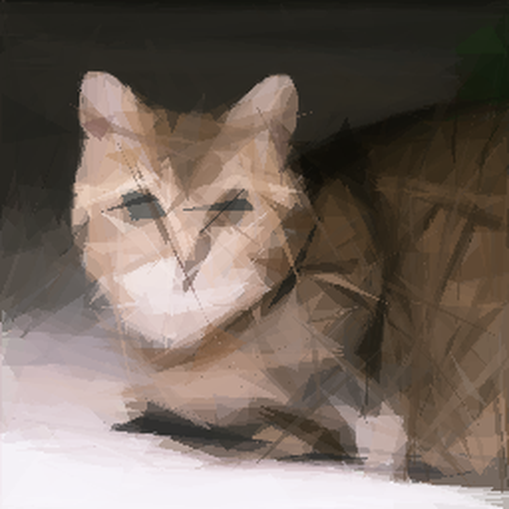

# Primitive Pictures - Python Implementation

Reproducing images with geometric primitives using PyTorch.

## Showcase

<table>
<tr>
    <td></td>
    <td></td>
    <td></td>
</tr>
<tr>
    <td align="center">Picasso (200 triangles)</td>
    <td align="center">Mona Lisa (200 triangles)</td>
    <td align="center">Cat (200 triangles)</td>
</tr>
</table>

### Animation Showcase

Watch how images are progressively built up using geometric shapes:

<div align="center">
  <table>
  <tr>
    <td></td>
    <td></td>
    <td></td>
  </tr>
  <tr>
    <td align="center">Picasso</td>
    <td align="center">Mona Lisa</td>
    <td align="center">Cat</td>
  </tr>
  </table>
</div>

> **Note:** Our intelligent frame distribution strategy focuses more frames on the first 50 shapes and fewer frames on later shapes, creating smooth, compact animations even with 200+ shapes.

## Overview

This is a Python reimplementation of the [original Primitive project](https://github.com/fogleman/primitive) by Michael Fogleman, with significant enhancements:

1. **PyTorch Backend**: Leverages PyTorch for tensor operations and optimization
2. **Advanced Animation Controls**: Fine-tune animation speed and quality
3. **Optimized Shape Search**: Uses advanced optimization algorithms for better shape finding
4. **Batch Processing**: Evaluates multiple shapes simultaneously in parallel
5. **Python Ecosystem**: Takes advantage of the Python ecosystem for image processing and visualization

The algorithm approximates images by finding optimal geometric shapes (triangles, rectangles, ellipses, etc.) to add one at a time, with each shape improving the overall approximation.

## Installation

### Requirements

- Python 3.7 or later
- PyTorch 1.12 or later

### Install from Source

```bash
# Clone the repository
git clone https://github.com/yourusername/primitive.git
cd primitive

# Install from source
pip install -e py_primitive
```

## Usage

### Command Line

```bash
py_primitive -i input.jpg -o output.png -n 100 -m 1
```

### Quick Start with run_example.py

For convenience, you can use the wrapper script that has some sensible defaults:

```bash
python run_example.py [input_image] [--size SIZE] [--shapes SHAPES] [--fps FPS]
```

This script will:
- Use the default Mona Lisa image if none is provided
- Auto-detect and preserve original image dimensions by default
- Generate triangles (the most effective primitive shape)
- Save outputs to the `/outputs` directory

### Parameters

| Flag | Default | Description |
| --- | --- | --- |
| `-i, --input` | n/a | input file (required) |
| `-o, --output` | n/a | output file (required, can be specified multiple times) |
| `-n, --num` | n/a | number of shapes (required) |
| `-m, --mode` | 1 | 0=combo, 1=triangle, 2=rectangle, 3=ellipse, 4=circle, 5=rotated_rectangle |
| `-a, --alpha` | 128 | alpha value (0-255, use 0 to let algorithm choose) |
| `-r, --resize` | 256 | resize input image to this size before processing |
| `-s, --size` | 1024 | output image size |
| `-j, --workers` | 0 | number of parallel workers (default uses all cores) |
| `--use-gpu` | false | enable experimental GPU acceleration (may be slower than CPU) |
| `--population` | 50 | population size for optimization algorithm |
| `--generations` | 20 | number of generations for optimization algorithm |
| `--frames` | 0 | number of frames for animation (0 = all shapes) |
| `--fps` | 5 | frames per second for animation playback |
| `-v, --verbose` | false | enable verbose output |

### Output Formats

- PNG/JPG: Raster output
- SVG: Vector output
- GIF: Animated output showing shapes being added

### Examples

```bash
# Basic triangle example, 100 shapes
py_primitive -i input.jpg -o output.png -n 100

# Rectangle example with 200 shapes, save both PNG and SVG
py_primitive -i input.jpg -o output.png -o output.svg -n 200 -m 2

# Create an animation with 50 frames
py_primitive -i input.jpg -o animation.gif -n 100 --frames 50

# Use ellipses with higher population and generations for better results
py_primitive -i input.jpg -o output.png -n 50 -m 3 --population 100 --generations 30

# Create a slower animation with 3 FPS
py_primitive -i input.jpg -o animation.gif -n 100 --frames 50 --fps 3
```

## Shape Types

The following shape types are supported:

1. **Triangle (mode 1)**: Three-point polygons, excellent for most image approximations
2. **Rectangle (mode 2)**: Axis-aligned rectangles
3. **Ellipse (mode 3)**: Axis-aligned ellipses
4. **Circle (mode 4)**: Perfect circles
5. **Rotated Rectangle (mode 5)**: Rectangles with arbitrary rotation

Each shape type offers different characteristics:
- Triangles provide excellent coverage and detail with minimal shapes
- Rectangles work well for architectural images with straight lines
- Ellipses and circles excel at organic forms and portraits
- Rotated rectangles can capture diagonal features effectively

## Performance

The Python implementation offers several advantages over the original Go version:

- **Better animation control** with customizable FPS
- **Improved quality** due to testing more shape variations
- **Better optimization** through advanced algorithms
- **Python ecosystem** integration for easy extension

### GPU Acceleration (Experimental)

This implementation includes experimental GPU support via PyTorch's Metal Performance Shaders (MPS) backend on Apple Silicon Macs. However, our testing shows that in most cases, the CPU implementation is actually faster than the GPU version for this particular workload.

The GPU acceleration can be enabled with the `--use-gpu` flag, but be aware it may result in slower performance. This feature is currently experimental and may be improved in future updates.

### Performance Optimizations

This implementation includes several optimizations for speed:

1. **Parallel Processing**: Shapes are evaluated in parallel for improved performance
2. **Early Stopping**: The optimization algorithm stops early when no improvements are detected
3. **Tensor Caching**: Common tensor operations are cached to reduce redundant calculations
4. **Memory Management**: Periodic memory clearing prevents out-of-memory issues
5. **Progress Tracking**: Real-time progress reporting with time estimates

### Performance Tuning

You can adjust these parameters for optimal performance on your hardware:

```bash
# Faster execution with smaller resolution and fewer shapes/generations
py_primitive -i input.jpg -o output.png -n 50 -r 128 --population 20 --generations 5

# Higher quality with more shapes and generations (slower)
py_primitive -i input.jpg -o output.png -n 200 -r 256 --population 50 --generations 20
```

## How It Works

The core algorithm works as follows:

1. Start with a blank canvas (or average color of target image)
2. For each iteration:
   - Initialize a population of random shapes
   - Evaluate each shape in parallel on the GPU
   - Run optimization to find the optimal shape
   - Add the best shape to the canvas
3. Repeat until the desired number of shapes is reached

## Technical Implementation Details

### Optimization Algorithm

The Python implementation uses **Differential Evolution** for shape optimization:

```
┌─────────────────────────────────────────────────────────────────────────┐
│                     Differential Evolution Pipeline                      │
│                                                                         │
│  ┌─────────────┐   ┌─────────────┐   ┌─────────────┐   ┌─────────────┐  │
│  │ Initialize  │   │  Mutation   │   │  Crossover  │   │  Selection  │  │
│  │ Population  │──>│  Process    │──>│  Operation  │──>│  Process    │  │
│  └─────────────┘   └─────────────┘   └─────────────┘   └─────────────┘  │
│         │                                                      │         │
│         └──────────────────────────────────────────────────────┘         │
│                              Next Generation                             │
└─────────────────────────────────────────────────────────────────────────┘
```

The algorithm works as follows:

1. **Population Initialization**: Generate a population of random shapes (controlled by `--population`)
   - Each individual represents a potential shape (position, size, color, etc.)
   - Initial shapes are distributed randomly across the image
   - This creates genetic diversity in the starting population

2. **Fitness Evaluation**: Calculate how well each shape improves the current approximation
   - Render each shape onto a copy of the current canvas
   - Calculate mean squared error (MSE) between this canvas and the target image
   - Lower MSE scores indicate better shapes
   - This creates a selection pressure toward shapes that best match the target image

3. **Evolution Process**:
   - For each generation (controlled by `--generations`):
     
     a. **Mutation**: Create variations by combining parameters from existing shapes
     ```
     For each individual in the population:
       mutant = base_vector + F*(random_vector_1 - random_vector_2)
     ```
     Where F is a scaling factor that controls the amplification of differences
     
     b. **Crossover**: Mix the mutant with the original individual
     ```
     For each parameter in the shape:
       if random() < crossover_rate:
         trial_individual[parameter] = mutant[parameter]
       else:
         trial_individual[parameter] = original_individual[parameter]
     ```
     
     c. **Selection**: Keep the better of the trial and original individuals
     ```
     If fitness(trial_individual) < fitness(original_individual):
       population[i] = trial_individual
     Else:
       population[i] = original_individual
     ```

4. **Selection**: Choose the best shape from the final generation

#### Visual Example of Shape Evolution

```
Generation 1        Generation 5        Generation 10       Generation 20
┌────────────┐      ┌────────────┐      ┌────────────┐      ┌────────────┐
│            │      │            │      │            │      │            │
│   ▲  ▲     │      │   ▲        │      │   ▲        │      │   ▲        │
│  ▲ ▲ ▲ ▲   │      │  ▲▲▲       │      │   ▲▲       │      │   ▲▲       │
│ ▲ ▲▲▲▲▲ ▲  │ ---> │  ▲▲▲▲      │ ---> │  ▲▲▲▲      │ ---> │  ▲▲▲▲      │
│ ▲▲▲▲▲▲▲▲   │      │ ▲▲▲▲▲      │      │ ▲▲▲▲▲      │      │ ▲▲▲▲▲▲     │
│▲▲▲▲▲▲▲▲▲▲▲ │      │▲▲▲▲▲▲▲     │      │▲▲▲▲▲▲▲     │      │▲▲▲▲▲▲▲     │
└────────────┘      └────────────┘      └────────────┘      └────────────┘
  Random shapes       Better fit         Getting closer       Optimal shape
```

This visualization demonstrates how the shape population evolves over generations, gradually converging toward a more optimal representation that better matches the target image.

#### Why Differential Evolution Works Better

Differential Evolution offers several advantages over simpler optimizers like hill climbing:

1. **Global Optimization**: Less likely to get stuck in local optima
2. **Parallel Evaluation**: Multiple candidates are evaluated simultaneously
3. **Self-Adaptation**: The algorithm automatically adapts to the fitness landscape
4. **No Gradient Required**: Works well for non-differentiable problems

The parallel nature of the algorithm is particularly well-suited for GPU acceleration, though our implementation currently uses CPU-only multiprocessing for most operations.

### Shape Representation

Each shape type has its own class with specific parameters:

1. **Triangle**: Three vertices (x1, y1, x2, y2, x3, y3)
2. **Rectangle**: Position, width, height (x, y, width, height)
3. **Ellipse**: Center, radii, rotation (x, y, rx, ry, angle)
4. **Circle**: Center, radius (x, y, radius)
5. **Rotated Rectangle**: Position, width, height, rotation (x, y, width, height, angle)

Each shape also has an RGBA color with alpha for transparency.

### Tensor Operations

The implementation leverages PyTorch for efficient tensor operations:

1. **Shape Rendering**: Shapes are rendered as binary masks (0 or 1) using tensor operations
2. **Batch Processing**: Multiple shapes are evaluated simultaneously in batches
3. **Alpha Blending**: New shapes are blended with the existing canvas using alpha compositing:
   ```
   new_canvas = current_canvas * (1 - shape_mask * alpha) + shape_color * shape_mask * alpha
   ```

### Performance Optimizations

Several optimizations improve performance:

1. **Parallel Evaluation**: Shapes are evaluated in parallel batches
2. **Early Stopping**: The optimization stops if no improvement is detected after several generations
3. **Tensor Caching**: Common tensor operations are cached to reduce redundant calculations
4. **Memory Management**: Periodic memory clearing prevents out-of-memory issues
5. **Adaptive Sampling**: The number of candidates is adjusted based on available resources

### Animation Generation

The animation process works as follows:

1. Start with the background color frame
2. For each selected frame index:
   - Reset to the background
   - Add shapes progressively up to that index
   - Convert the result to a PIL Image
3. Combine all frames into a GIF with the specified FPS

## Animation Control

The animation process uses an intelligent frame distribution strategy that balances detail and file size:

```
┌─────────────────────────────────────────────────────────────────────────┐
│                      Progressive Frame Distribution                      │
│                                                                         │
│  Frame         ██                                                        │
│  Density       ██                                                        │
│  ▲             ██                                                        │
│  │             ██        ██                                              │
│  │             ██        ██                                              │
│  │             ██        ██        ██                                    │
│  │             ██        ██        ██                ██                  │
│  │             ██        ██        ██                ██                  │
│  │ ─────────────────────────────────────────────────────────────────▶   │
│      1        10        30        50                200                  │
│                                Shapes                                    │
└─────────────────────────────────────────────────────────────────────────┘
```

1. **First 10 shapes**: Every shape is included to capture initial major structural changes
2. **Shapes 11-30**: Every 2nd shape is included to show medium-scale refinements
3. **Shapes 31-50**: Every 3rd shape is included to show finer adjustments
4. **Shapes 51+**: Every 5th shape is included to show detail refinements

This progressive distribution ensures that animations remain smooth and informative while keeping file sizes manageable, even with hundreds of shapes. The strategy is particularly effective for:
- Capturing major structural changes in early shapes
- Showing medium-scale refinements at a good pace
- Maintaining reasonable file sizes for longer animations
- Ensuring smooth playback on all devices

When creating GIF animations, you can control:

- **Frame Count**: Set with `--frames` (0 means use the progressive distribution strategy)
- **Playback Speed**: Set with `--fps` (default is 5 FPS for smooth but detailed viewing)

Example usage:
```bash
# Create animation with 200 shapes using progressive distribution
py_primitive -i input.jpg -o animation.gif -n 200 --fps 5

# Create a slower animation for more detailed viewing
py_primitive -i input.jpg -o animation.gif -n 200 --fps 3
```

## Python API

You can also use the library programmatically:

```python
from py_primitive.primitive.model import PrimitiveModel

# Create model
model = PrimitiveModel("input.jpg")

# Run for 100 shapes
model.run(100)

# Save outputs
model.save_image("output.png")
model.save_svg("output.svg")
model.save_animation("animation.gif", frame_count=20, fps=5)
```

## Artistic Techniques and Customization

The Primitive algorithm can produce a wide range of artistic styles and effects by adjusting various parameters. Here are some techniques to create unique visual results:

### Creating Different Aesthetic Styles

```
┌─────────────────────┬─────────────────────┬─────────────────────┐
│ Photorealistic      │ Abstract            │ Geometric Art       │
├─────────────────────┼─────────────────────┼─────────────────────┤
│ • 200+ shapes       │ • 30-50 shapes      │ • 50-100 shapes     │
│ • Small alpha       │ • High alpha        │ • Medium alpha      │
│ • Triangle mode     │ • Circle mode       │ • Mixed shapes      │
│ • High population   │ • Low population    │ • Medium population │
└─────────────────────┴─────────────────────┴─────────────────────┘
```

### Parameter Combinations for Different Effects

1. **Photorealistic Approximation**
   ```bash
   py_primitive -i portrait.jpg -o realistic.png -n 300 -m 1 -a 80 --population 100 --generations 30
   ```
   - Use more shapes (200+)
   - Lower alpha values (60-100)
   - Prefer triangles or mixed shapes
   - Higher optimization parameters

2. **Abstract Interpretation**
   ```bash
   py_primitive -i landscape.jpg -o abstract.png -n 50 -m 4 -a 180 --population 30 --generations 10
   ```
   - Fewer shapes (30-70)
   - Higher alpha values (150-220)
   - Prefer circles or ellipses
   - Lower optimization parameters

3. **Geometric Minimalism**
   ```bash
   py_primitive -i portrait.jpg -o geometric.png -n 100 -m 5 -a 128 --population 50 --generations 20
   ```
   - Medium shape count (80-150)
   - Medium alpha values (100-150)
   - Prefer rotated rectangles
   - Medium optimization parameters

4. **Stained Glass Effect**
   ```bash
   py_primitive -i building.jpg -o stained.png -n 120 -m 1 -a 200 --population 40 --generations 15
   ```
   - Medium shape count (100-150)
   - High alpha values (180-220)
   - Triangles only
   - Add a post-processing black outline if desired

### Advanced Customization

For more advanced customization, you can modify the code to:

1. **Custom Shape Types**: Implement new shape classes by extending the base Shape class
2. **Color Palettes**: Modify the color selection to use a predefined palette instead of optimal colors
3. **Optimization Parameters**: Adjust the differential evolution parameters (F and CR values)
4. **Shape Selection Bias**: Modify the fitness function to prefer certain shapes or areas

Example Python code for custom shape coloring:

```python
from py_primitive.primitive.model import PrimitiveModel

# Create model
model = PrimitiveModel("input.jpg")

# Define custom color palette
palette = [
    (255, 0, 0, 128),    # Red
    (0, 255, 0, 128),    # Green
    (0, 0, 255, 128),    # Blue
    (255, 255, 0, 128),  # Yellow
]

# Run for 100 shapes with custom coloring
for i in range(100):
    # Use modulo to cycle through palette
    color = palette[i % len(palette)]
    model.step(shape_type=1, color=color)

# Save outputs
model.save_image("custom_palette.png")
```

### Experimenting with Parameters

The best way to find a style you like is to experiment with different parameter combinations. Here's a simple grid to start with:

| Parameter | Low | Medium | High |
|-----------|-----|--------|------|
| Shapes    | 30-50 | 80-150 | 200+ |
| Alpha     | 60-100 | 100-150 | 150-220 |
| Population| 20-30 | 40-60 | 80-100 |
| Generations | 5-10 | 15-25 | 30-50 |

Each combination will produce a different aesthetic result. Try mixing different shape types for even more variation.

## License

This project is licensed under the MIT License - see the LICENSE file for details.

## Acknowledgements

This project is a Python reimplementation of the original [Primitive](https://github.com/fogleman/primitive) by Michael Fogleman. 